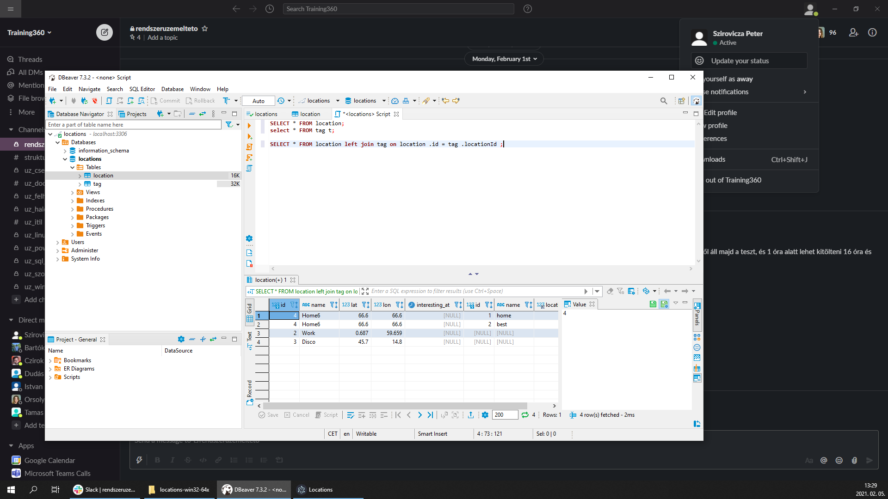

# training360-szoftverarchitekturak
<h3>Konzolos alkalmazás</h3>

<h3>Standalone alkalmazás grafikus felülettel</h3>

<h3>Központi adatbázis</h3>

<h3>NoSQL</h3>

<h3>SQL</h3>

<h3>Többrétegű alkalmazás</h3>

<h3>Webes alkalmazás</h3>

